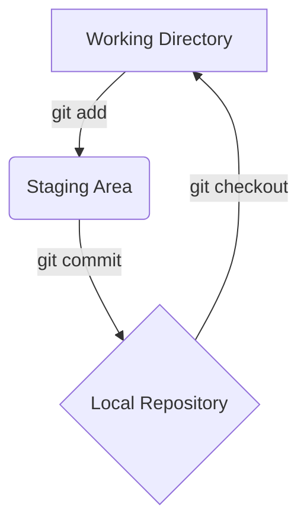

# 1. Git 基礎指令 🛠️

在這個章節，我們將學習 Git 最核心的幾個指令，並在 `practice-repo` 資料夾中進行第一次的實戰演練。

## 核心概念：三個區域

要理解 Git，首先要認識三個主要的工作區域：

1.  **工作目錄 (Working Directory)**：這就是您在電腦上能直接看到、編輯的專案資料夾。
2.  **暫存區 (Staging Area)**：這是一個看不見的區域，像是一個購物籃。當您對檔案做了修改後，可以先用 `git add` 將「想要提交的變更」放進這個籃子裡。
3.  **本地倉庫 (Local Repository)**：當您執行 `git commit` 時，Git 會將暫存區裡的所有內容，打包成一個版本快照，永久地儲存在您電腦裡的 `.git` 資料夾中。

**工作流程就是：在 `工作目錄` 修改 -> `add` 到 `暫存區` -> `commit` 到 `本地倉庫`。**



## 指令說明

*   `git init`
    *   **用途**：初始化一個新的 Git 倉庫。這會在當前資料夾建立一個隱藏的 `.git` 子目錄，用來存放所有版本控制相關的資訊。
    *   **只會執行一次**：在專案剛開始時執行。

*   `git add <檔案名稱>`
    *   **用途**：將檔案的變更從「工作目錄」加入到「暫存區」。
    *   **Pro-Tip**：使用 `git add .` 可以一次將所有變更的檔案都加入暫存區。

*   `git commit -m "您的提交訊息"`
    *   **用途**：將「暫存區」裡的所有變更正式儲存到本地倉庫的歷史紀錄中。每一次 `commit` 就是一個版本快照。
    *   `-m` 參數後面的訊息是對這次變更的簡短描述。**撰寫清晰、有意義的提交訊息是專業開發者的基本素養！**

*   `git status`
    *   **用途**：檢查目前工作目錄和暫存區的狀態。這是您最常會用到的指令之一，它可以告訴您：
        *   哪些檔案被修改了但還沒加入暫存區？(Changes not staged for commit)
        *   哪些檔案已經在暫存區，準備被提交？(Changes to be committed)
        *   哪些是 Git 還沒開始追蹤的新檔案？(Untracked files)

---

## 💪 動手做：您的第一個 Commit

現在，讓我們實際操作一次！

1.  **進入練習目錄**：
    打開您的終端機 (Command Prompt, PowerShell, or Terminal)，並切換到我們之前建立的 `practice-repo` 資料夾。
    ```bash
    cd C:\Users\User\Desktop\新增資料夾\git-tutorial\practice-repo
    ```

2.  **初始化倉庫**：
    ```bash
    git init
    ```
    您會看到類似 `Initialized empty Git repository in ...` 的訊息。

3.  **建立新檔案**：
    在 `practice-repo` 資料夾中，建立一個名為 `hello.txt` 的文字檔案，內容寫上 `Hello, Git!`。

4.  **檢查狀態**：
    執行 `git status`。您會看到 `hello.txt` 出現在 `Untracked files` 清單中。
    ```bash
    git status
    ```

5.  **加入暫存區**：
    ```bash
    git add hello.txt
    ```
    再次執行 `git status`，您會發現 `hello.txt` 現在位於 `Changes to be committed` 清單中。

6.  **提交變更**：
    ```bash
    git commit -m "Add hello.txt"
    ```
    恭喜！🎉 您已經完成了第一次的提交。再執行一次 `git status`，您會看到 `nothing to commit, working tree clean` 的訊息，代表所有變更都已經被妥善保存。

---

## 下一步

您已經掌握了最基本的 Git 工作流程！接下來，我們將在 `02-Branching-and-Merging.md` 中學習 Git 最強大的功能之一：分支。
